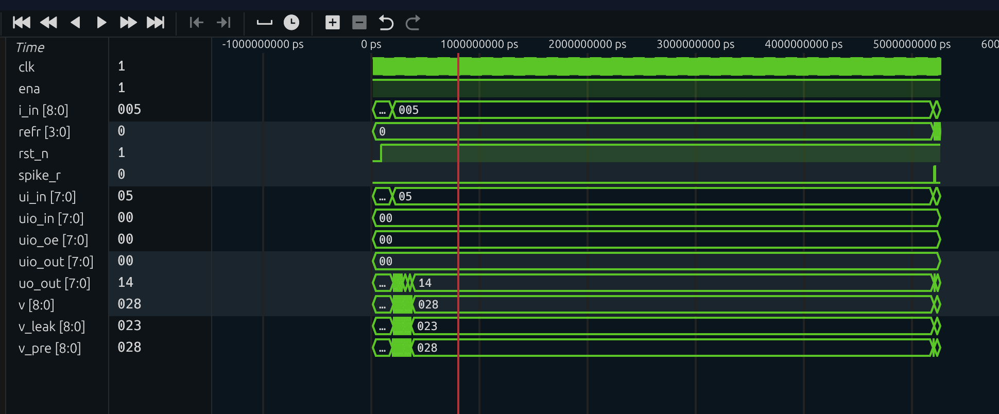
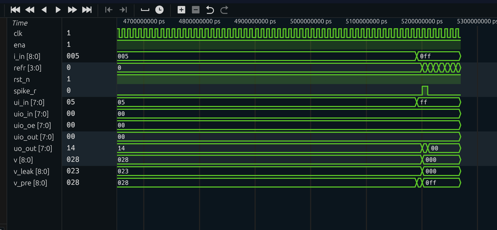
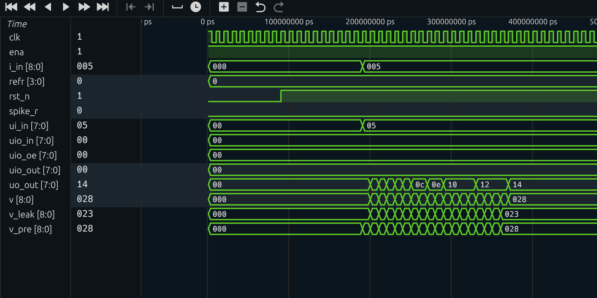

# Leaky Integrate-and-Fire Neuron (TinyTapeout Project)

## Overview

This project implements a digital Leaky Integrate-and-Fire (LIF) neuron using Verilog.  
The neuron integrates an input current over time, applies membrane leakage, generates a spike when a threshold is reached, and enters a refractory period before resuming integration.

This design demonstrates core neuromorphic computing behavior using simple synchronous digital logic suitable for ASIC implementation.

---

## Features

- Membrane potential integration
- Exponential-like leakage using shift arithmetic
- Configurable spike threshold
- Single-cycle spike pulse output
- Refractory period after spike
- Debug output of membrane potential

---

## Inputs

| Signal | Description |
|--------|-------------|
| `ui_in[7:0]` | Input current to neuron |
| `clk` | System clock |
| `rst_n` | Active-low reset |
| `ena` | Enable signal |

---

## Outputs

| Signal | Description |
|--------|-------------|
| `uo_out[0]` | Spike output |
| `uo_out[7:1]` | Membrane potential (debug) |

---

## Architecture

The neuron consists of three main blocks:

1. **Integrator**
   - Adds input current to membrane potential
   - Applies leakage each cycle

2. **Comparator**
   - Checks if membrane potential exceeds threshold

3. **Spike + Refractory Logic**
   - Generates one-cycle spike pulse
   - Resets membrane potential
   - Starts refractory counter

---

## Mathematical Model

The neuron behavior approximates:

\[
V_{t+1} = V_t - \frac{V_t}{2^{k}} + I_t
\]

where:

- \(V_t\) = membrane potential
- \(I_t\) = input current
- \(k\) = leak constant

Spike condition:

\[
\text{if } V_t \geq V_{th} \Rightarrow \text{spike}
\]

After spike:

\[
V = 0 \quad \text{and refractory counter starts}
\]

---

## Simulation Results

The waveform below shows:

- Membrane integration
- Spike generation
- Refractory period
- Integration restart

---

## Applications

- Neuromorphic processors
- Spiking neural networks
- Edge AI hardware
- Brain-inspired computing research

Archetecture Design:
ui_in → Integrator → Comparator → Spike → uo_out[0]
              ↑            ↓
             Leak        Reset
                        Refractory Counter

---

## Author

Qudsi Aljabiri
ECE 210 Project

